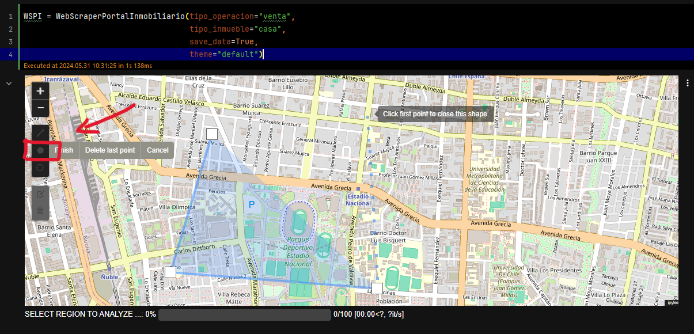
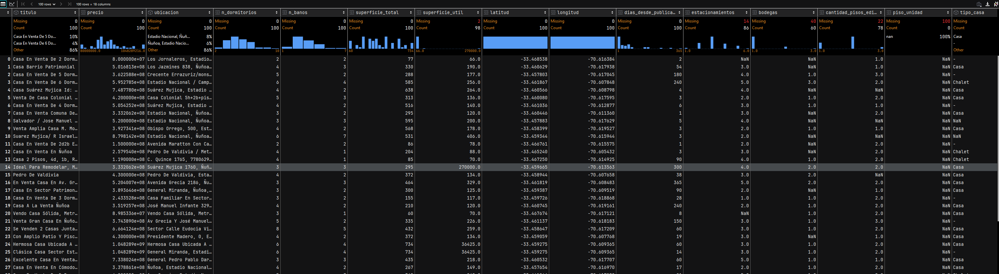

# portal inmobiliario web scraper


Te ha pasado que navegas por el portal inmobiliario y te interesa un sector en particular. Luego debes ir uno por uno revisando cada casa o proyecto para anotar y calcular métricas que te interesen... bueno, con esta herramienta esa rutina se acabó, **elige un sector y obtén un dataframe** con la data.


Esta herramienta se presenta como una clase de fácil uso, requiere que se ejecute en un jupyter.
Deberemos importarla:

```python
from webscrapper_portal_inmobiliario import *
```

Inicializamos la clase con la variable que nos interesan dentro de las cuales tenemos las siguientes opciones:
#### Tipo de operación:
- venta
- Arriendo

#### Tipo de inmueble:
- Casa
- Departamento
También tiene la opción de guardar automáticamente toda la data en un CSV,  en el path que tenga el jupyter ejecutándose.

```python
WSPI = WebScraperPortalInmobiliario(tipo_operacion="venta",
                                    tipo_inmueble="casa",
                                    save_data=True,
                                    theme="default")
```

Elegimos utilizando la selección poligonal:



Los resultados quedan dentro de la clase como df_results, siendo ahora posible un sinfín de cálculos e insights que 
podrían ayudarnos a tomar una mejor decisión a la hora de invertir.




## La propiedad mas rentable del sector

todo:
- obtener df ventas y arriendos del mismo sector
- Obtener los CAPRATE de cada casa segun sus propiedades


