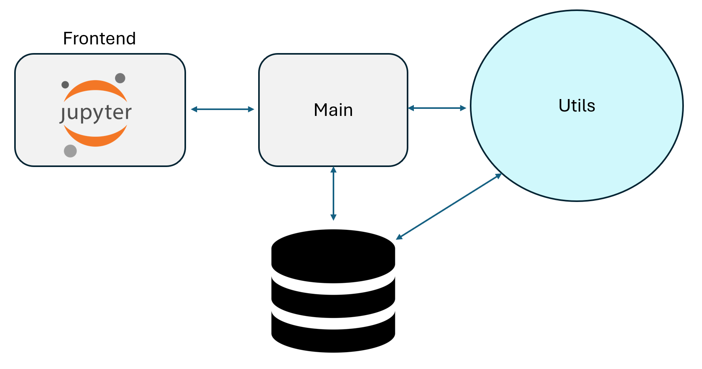

# portal inmobiliario web scraper & analyzer

## [Full Article: ML for real estate](https://neozro.github.io/project_1_portal_inmobiliario.html)

The search for housing is a complex and tedious process. 
To simplify it, I set out to create a tool that searches for investment opportunities, 
specifically on the future line 8 of the subway (Stgo,Chile), taking advantage of the potential appreciation
of real estate.


Its pretty simple to use, just execute it in a jupyter.
The main structure works as follows:

```python
from webscrapper_portal_inmobiliario import WebScraperPortalInmobiliario
```

```python
WSPI = WebScraperPortalInmobiliario()
```

```python
WSPI.insert_new_cluser_map("cluster_1",None)
```

```python
WSPI.list_db_maps()
```

```python
WSPI.vis_map(selected_mapID=1)
```

```python
WSPI.start_download(selected_mapID=1)
```

<div style="text-align: center;">
    
</div>


For a deeper understanding, you can refer to my article where I train a machine learning model using the data.


